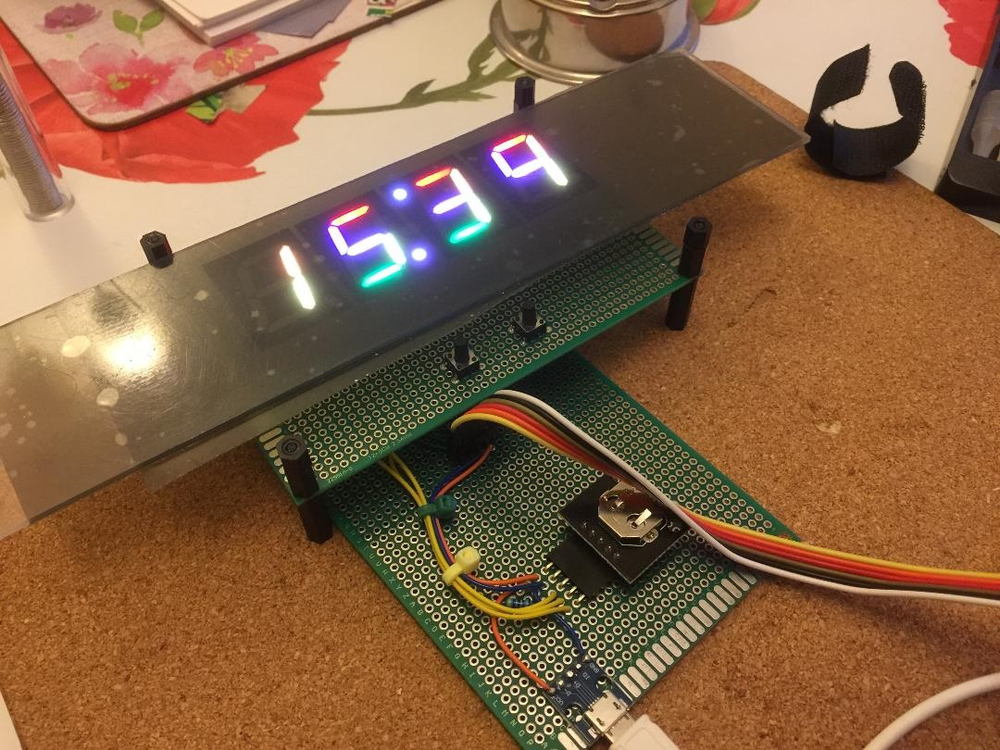

# An RGB Seven Segment Clock
A couple of years ago I bought some RGB seven segment displays from [RGBDigit](https://www.rgbdigit.com/rgbdigit/) intending to build a clock for one of my children. I wrote the code to set the Neo Pixel state but then the project got pushed down the priority list. A few weeks ago I decided to try and finish it as a Christmas present.

As clocks are not particulary hard to code and the Neo Pixel interface needs fairly accurately timed signals I decided to write the firmware in assembly for a Microchip PIC 16F1454.

You could use virtually any PIC for this kind of job but the 16F1454 has a higher internal clock speed (48MHz = 12MIPs) because of its support for USB which makes it little easier to match the Neo Pixel signal timing.

To minimise the wiring I found some DS1307 real time clock modules on eBay that come with a back up battery and for power I am using a USB micro socket on a small adapter board (also from eBay).

## Hardware
As my clock was a one off I decided to use prototyping boards for the display and control electronics. All the wiring is on what will be the inside of the assembled clock.

Even with the RGB colour values scaled to 20% of the highest (255) value they are very bright and I'm intending to laser cut a piece of acrylic to go on the front to both diffuse the LEDs and improve the contrast. At the moment I have a thin strip coated in a stick on diffusing film.

## Firmware
On start up the firmware configures the I/O ports and sets up a regular 100Hz timer interrupt. The switches are connected to pins on port A (RA4 & RA5) and have the internal pull up resistors enabled.

The DS1307 is read at start up and if it contains a valid time and is enabled then it is used to set the initial displayed time, otherwise the time resets to '00:00' and the RTC is initialised.

All though the micro-controller has an on board MSSP peripherial that supports I2C the pins that uses are also used for 'In Circuit Serial Programming' (ICSP) so I bit bash the protocol through some normal I/O pins.

I had originally wanted to connect the SQW output from RTC to an 'Interrupt on Change' pin to trigger an interrupt that would keep the clock time value synchronised with the RTC but I found the two free pins on port A (RA0 & RA1) hard to work with (one seemed to be output ICSP debug pulses) so instead I check the pin as part of the 100Hz timer interrupt handler to see if its changed.

The design of the DS1307 RTC board seems to have changed over time. The image on the listing I bought from was different from what actually turned up. Testing with a multimeter showed that the module had 4K7 pull up resistors on SCL and SDA but not on SQW so I have an external resistor on that signal.

# Operation
On power up the clock displays the time and flashes the central dots once a second.

Pressing the left hand switch takes you into time setting mode. The hours flash and can be advanced by pressing the right switch for one increment or holding it pressed for auto repeating increments. Another press to the left switch lets you change the minutes value. A final press of the left switch updates the RTC with the final value and returns to time display.

Pressing the right hand switch cycles the display through different colour themes. Currently these are:

- Each segment has fixed rainbow colour
- Each digit 0-9 has a fixed coluur
- Colour cycling based on the last digit of the minutes
- Colour cycling based on the hour of the day.

In the first three modes the intensity of the display is reduced when the time is between 10pm and 6am. In the last mode darker colours are used at night.